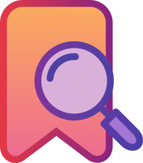
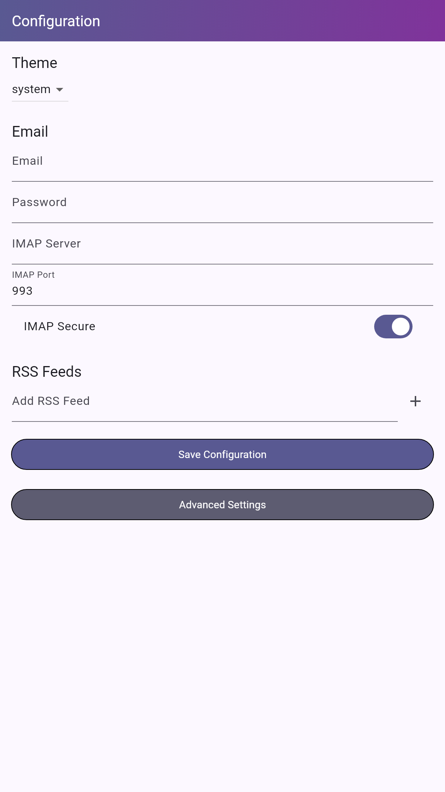
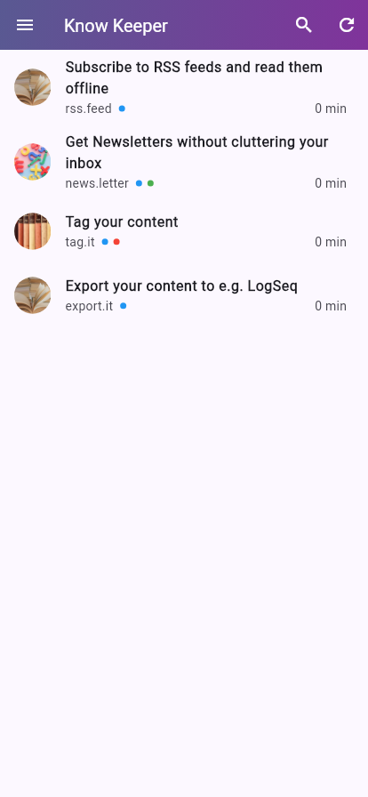
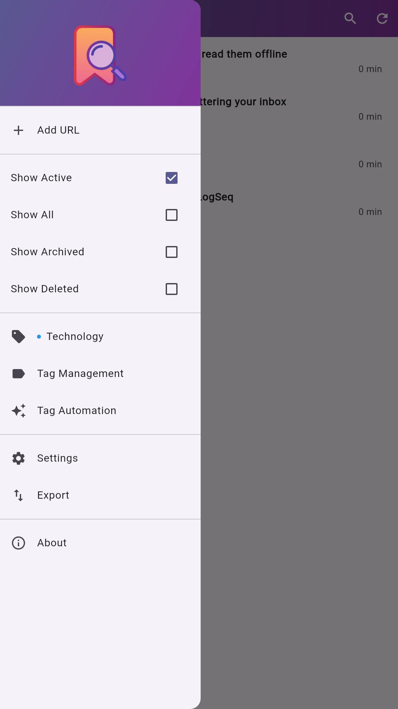
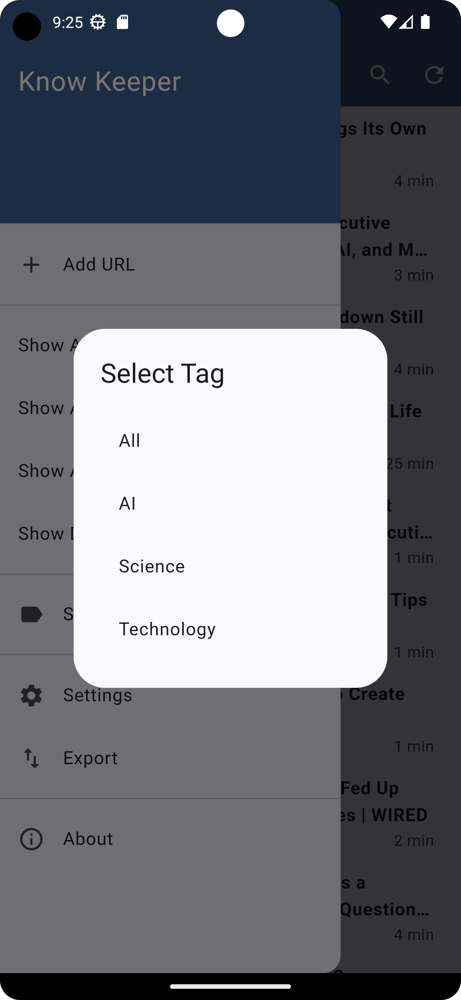
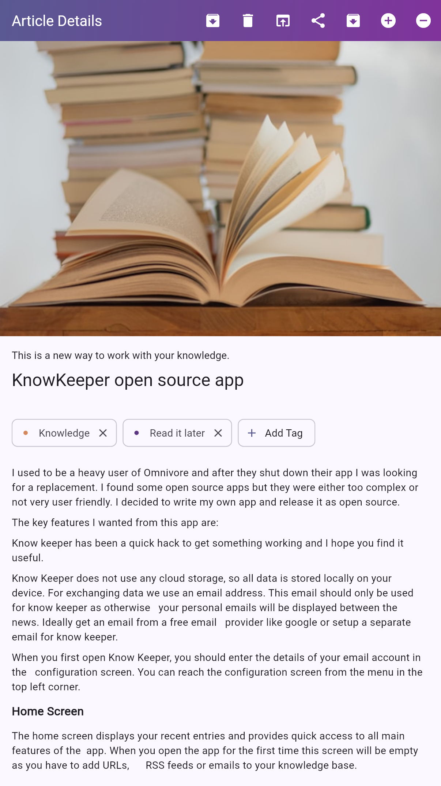
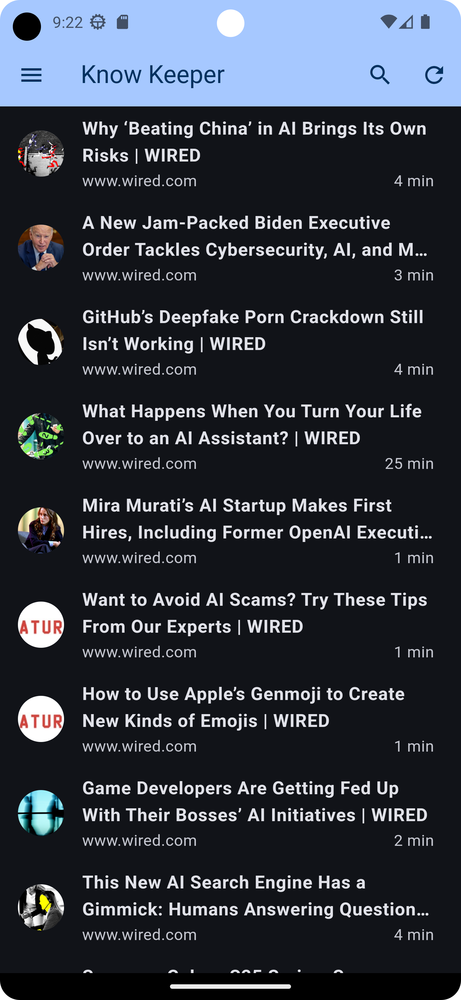
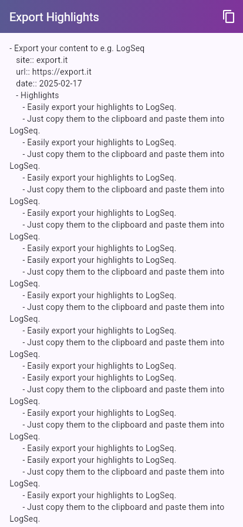

# Know Keeper

I used to be a heavy user of Omnivore and after they shut down their app I was looking for a 
replacement. I found some open source apps but they were either too complex or not very user 
friendly. I decided to write my own app and release it as open source. 

The key features I wanted from this app are:

* Easy to use
* No complicated cloud-based backend
* Support for RSS feeds
* Support for email newsletters in the same app
* Support for Read It Later integration to store bookmarks
* Highlighting important text 
* Export your highlights in Markdown format (to then be used e.g. in LogSeq)

Know keeper has been a quick hack to get something working and I hope you find it useful.

**Please be aware that this is work in progress and an early alpha version. I don't know if I am 
going to add features but if I do so it might break the existing database and you might lose your
data. Feel free to test it and let me know if you find any bugs.**

# Know Keeper User Manual

Know Keeper is an open source knowledge management app that helps you organize and access information 
from various sources. This guide will walk you through the main features of the app.

## Table of Contents
1. [Getting Started](#getting-started)
2. [Home Screen](#home-screen)
3. [Tagging and Filtering Content](#tagging-and-filtering-content)
4. [Adding Content](#adding-content)
5. [Viewing and Managing Content](#viewing-and-managing-content)
6. [Email Integration](#email-integration)
7. [RSS Feeds](#rss-feeds)
8. [Settings](#settings)
9. [Export](#export)
10. [Read it later](#read-it-later)
 
## Getting Started

Know Keeper does not use any cloud storage, so all data is stored locally on your device. For
exchanging data we use an email address. This email should only be used for know keeper as otherwise
your personal emails will be displayed between the news. Ideally get an email from a free email
provider like google or setup a separate email for know keeper.

When you first open Know Keeper, you should enter the details of your email account in the 
configuration screen. You can reach the configuration screen from the menu in the top left corner.




## Home Screen

The home screen displays your recent entries and provides quick access to all main features of the 
app. When you open the app for the first time this screen will be empty as you have to add URLs, 
RSS feeds or emails to your knowledge base.

You can pull the screen down to update the list and you can swipe left to either archive or delete 
an entry.

If you archive an entry, it will be moved to the archive section. The mail will stay on your server
and the data stays on your phone. 

Deleted entries will be removed after some time to free up space.

With the menu you can filter for deleted or archived entries and unarchive / undelete them.




## Tagging and Filtering Content

KnowKepper has a tagging system. You can add tags to your entries and filter for them.

1. Tap on an entry to view its full content.
2. The existing tags are shown at the top of the screen.
3. Tap on the 'Add Tags' button add a tag.
4. Either select an existing tag or create a new one.

On the home screen you can use the menu to only see entries with a specific tag. For that 
just select the tag from the menu.





## Adding Content

Know Keeper supports multiple ways to add content:

1. **Manual Entry**: Tap the '+ Add URL' entry in the menu to add a new note or URL manually.
2. **RSS Import**: Add a new RSS feed URL in the RSS Feeds section of the configuration page.
3. **Read It Later Integration**: The app automatically processes emails from configured accounts.
   When the subject contains "RL: ", followed by a URL, the app adds the URL to your knowledge base. 
4. **Newsletter**: All emails that are not processed by Read It Later will be added as a newsletter.
   This means the content itself is processed and added to the knowledge base.


## Viewing and Managing Content

- Tap on any entry to view its full content.
- Use the toolbar in the viewing screen to add a highlight by marking text and pressing the plus sign.
- Use the toolbar to remove a highlight by selecting text that is part of a highlight and pressing the minus sign.
- You can also open the original page in a web browser by tapping the link icon.
- By selecting the share icon you can share the entry to your friends.




## Email Integration

Know Keeper can process emails from your configured accounts:

1. Go to Settings > Email Integration.
2. Add your email account.
3. Add your server, port and credentials.
4. The app will periodically check for new emails and add them to your knowledge base.

## RSS Feeds

Manage your RSS feed subscriptions:

1. Go to Settings > RSS Feeds.
2. Add new RSS feed URLs.
3. The app will periodically check for new entries and add them to your knowledge base.

## Settings

Customize your Know Keeper experience:

- **Theme**: Choose between light and dark modes.



## Export

Under Settings there is a menu "Export" that allows you to export your highlights in Markdown format.
Either chose the copy sign from the taskbar to copy the content or select a portion of the text and.
copy it using the clipboard.



## Read it later

You can use the following simple bookmarktlet to add URLs to your knowledge base from the browser:

```javascript
javascript:(function(){
    var email = 'your-email@example.com';
    var subject = 'RL: ' + encodeURIComponent(window.location.href);
    var mailtoLink = 'mailto:' + email + '?subject=' + subject;
    window.location.href = mailtoLink;
})();
```

---

I hope this guide helps you make the most of Know Keeper. 
If you have any questions or need further assistance, please open a discussion on GitHub. 